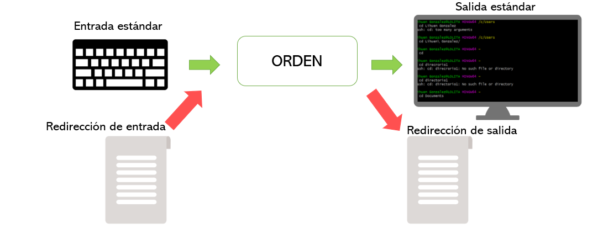

# Introducción a la línea de comandos
* * * 

## 1. Introducción
Al igual que las personas nos comunicamos entre nosotras a través de un idioma, las máquinas entienden también un lenguaje. Existen muchos lenguajes de programación, pero nosotros nos centraremos en el lenguaje de **Bash** (Bourne Again Shell), un intérprete de órdenes y lenguaje de programación empleado en distribuciones GNU/Linux. Si te interesa conocer más sobre el origen de Bash, dirígete a este [Link](https://es.wikipedia.org/wiki/Bash).

La razón por la cual trabajamos en esta Shell/lenguaje es que se trata de un lenguaje relativamente sencillo y muy robusto, lo que lo hace muy eficiente a la hora de usar memoria y correr procesos costosos. Además, permite crear entornos en los que se pueden usar otros lenguajes (Python, R, Perl, etc.), y por eso es un lenguaje básico en el análisis de datos procedentes de (meta)genómica y (meta)transcriptómica.

Como hemos dicho, Bash es un intérprete de órdenes, por lo que nos va a permitir dictarle órdenes concretas para que sean ejecutadas por nuestro ordenador. Las órdenes que recibe Bash, como cualquier lenguaje de programación, son estrictas, es decir, Bash irá interpretando caracter por caracter y si encuentra algo inesperado (algún caracter incorrecto, alguna mayuscula/minuscula cambiada, espacios donde no deben ir, etc) devolverá un error. Es importante tener esto en cuenta, ya que la mayor parte de los errores que cometemos mientras estamos trabajando en la shell se deben a fallos de escritura.

Una vez que Bash recibe la órden desde nuestro teclado (entrada estándar) y la interpreta correctamente, esta será ejecutada por el ordenador y nos imprimirá una respuesta en nuestra pantalla (salida estándar). De manera muy simplificada, este es el funcionamiento de Bash.


## 2. Navegación por el sistema de ficheros
Después de esta introducción, empezarémos con nuestros primeros comandos. Un aspecto básico y fundamental cuando trabajamos en la shell, es la navegación a través de nuestro sistema de ficheros. Normalmente, accedemos a nuestros documentos usando un explorador de archivos en el que los ficheros (archihvos) se encuentran organizados en directorios (carpetas) en un sistema jerarquico, y simplemente haciendo *clic* sobre ellos accedemos al directorio deseado, abrimos documentos, eliminamos ficheros, etc. En la terminal podremos hacer exactamente lo mismo, y para ello existen un conjunto de órdenes o comandos que usaremos continuamente.

### Primeras palabras
Imaginemos que nos despertamos en un lugar desconocido y no podemos ver nada, todo esta negro, como nuetsra terminal. En esta situación, se me ocurriría hacer preguntas como ¿qué hago aquí? y ¿dónde estoy?. La primera pregunta sólo la podréis responder vosotros, pero para la segunda Bash esta a nuestra disposición esperando a que introduzcamos órdenes (lo sabemos por el *prompt* o indicador, que en mi caso es el símbolo $). Para preguntar por nuestra ubicación en nuestro sistema de ficheros usarémos el comando `pwd` que significa *print working directory*. Este comando sirve para saber "dónde estamos". Bash nos devuelve una ruta o *path* en la que se indican los directorios en los que nos encontramos, separados cada uno por barras inclinadas (Directorio1/Directorio2/Directorio3). En mi caso:
```
$ pwd
/c/Users/lihuen
```
Esta ruta nos esta indicando que actualmente me encuentro en un directorio llamado "lihuen", que esta dentro de otro llamaso "Users", que a su vez esta en otro llamado "c" que se encuentra alojado en el directorio raíz.

Exito! Ya sé dónde estoy. Ahora quiero saber quién soy. Comandos como `whoami` o `id` nos ayudarána  saber más acerca de nosotros.
```
$ whoami
lihuen

$ id
uid=197609(lihuen) gid=197609 groups=197609
```
En resúmen, esto sería nuestro nombre y DNI. Ahora que ya sabemos dónde estamos y quienes somos, estaría bien saber si hay alguien con nosotros, aparte de ese ente superior que nos contesta a todas nuestras preguntas. En nuestro caso, estarémos sólos la mayoría, pero suele ser común en informática trabajar en servidores externos más potentes que el de nuestro ordenador. En estos casos, no serémos los únicos que usamos el servidor y viene bien saber quién esta con nosotros (comando `who`) e, incluso, interactuar con otros usuarios (comando `write`). 

Además de estas preguntas básicas, también podemos preguntar qué hay a nuestro alrededor. Para ello, usamos la órden `ls`, que devolverá por pantalla la lista de ficheros y/o directorios que hay dentro del directorio de trabajo en el que nos encontramos. ls tambien acepta como argumento una ruta o directorio concreto para ver su contenido sin necesidad de desplazarnos hasta dicho directorio para consultarlo.
```
ls
ls directorio
```
Llegados aquí es bueno apuntar que en Bash las órdenes tienen diferentes opciones que modifican ligeramente la función y nos pueden ser muy útiles cuando queremos hacer cosas concretas. Ejemplos de ello seria la opcion `-l` de la órden `ls`. Usando `ls -l` conseguiremos información detallada de cada directorio o fichero que se encuentre en el directorio de trabajo (permisos, dueño, inodo, tamaño, fecha de última mofidicación, etc).  
```
ls -l
```
Para conocer todas las opciones de una función puedes consultar el manual con la órden `man` o pedir ayuda a Bash con la opción `--help`. 
```
man ls
ls --help
```
### Primeros pasos
Ahora toca aprender a moverse por el sistema de ficheros. El comando más importante es `cd` (*change directory*). Si introducimo `cd` sin argumento, nos moveremos hacia el directorio raíz, mientras que si le indicamos una ruta, nos llevará al directorio indicado por la ruta. 
```
cd
cd directorio1/directorio2
```
Algo muy útil para movernos por nuetsro sistema de ficheros es indicarle a `cd` que nos lleve al directorio padre del directorio de trabajo, es decir, un directorio hacia atrás. Esto lo hacemos con dos puntos 
```
pwd
cd ..
pwd
```
Y si queremos crear un directorio nuevo para trabajar dentro de él, usamos la órden `mkdir` y el nombre del nuevo directorio. Prueba creando un directorio con el nombre Curso-bioinfo. A partir de ahora este será tu directorio de trabajo. Si queremos borrar un directorio usamos la órden `rmdir`, pero ésta solo funcionará si el directorio está vacío.

Otras órdenes muy úitiles para trabajar en línea de comandos son `cp`, `mv` y `rm`. Sirven para copiar, mover y borrar ficheros o directorioas, respectivamente. La órden `cp` acepta dos argumentos: primero el nombre o ruta del fichero/directorio que pretendemos copiar y luego el nombre o la ruta de la copia. Si sólo ponemos el nombre y no la ruta, Bash entiende que el fichero o directorio a copiar se encuentra en el directorio de trabajo y que la copia debe guardarse también en el directorio de trabajo. Vamos a crear un directorio de prueba y copiarlo.
```
mkdir PRUEBA
cp PRUEBA PRUEBA-copia
ls
```
El comando `mv` sirve para mover ficheros o directorios de una ubicación a otra. También acepta dos argumentos: el primero es la ruta del fichero/directorio que queremos mover y el segundo es la ruta destino, es decir, la nueva ubicación que queremos (incluyendo el nuevo nombre o el que ya tenía). Esta órden también se usa para cambiar el nombre a los ficheros o directorios.
```
```
**Cuidado**. Las acciones de copiar o mover cosas en nuestro sistema de ficheros son un arma de doble filo en UNIX, ya que no dispone de comprobación de sobreescritura. Esto conlleva la perdida de la información que teniamos antes en nuetsro fichero/directorio al sobreescribirse la nueva información. Si esto nos pasa, no habrá vuelta atrás. Lo mismo ocurre con la órden `rm`. UNIX no cuenta con una papelera a la que podamos recurrir si hemos borrado algo por error, asi que los ficheros que borremos con `rm` se pierden para siempre. 

Una opción interesante de `cp` y `rm` es la opcion -r (*recursive*), que copiará o borrará de manera recursiva todos los contenidos de un directorio. Es útil, por ejemplo, cuando `rmdir` nos dice que el directorio no se ha podido borrar porque no esta vacío.
```
```

Truquillos: autocompletado con el tabulador y acceso a comandos anteriores con las flechas

## 3. Redirección de entradas y salidas
Hasta ahora hemos visto cómo darle una órden a Bash  y cómo este las ejecuta devilviendo su respuesta por pantalla (la salida estándar). De hecho, ahora mismo tendrás tu pantalla llena de cosas. Si en algún momento te agobias y quieres limpiar tu pantalla, teclea `clear` y obtendrás paz mental.

Como os decia, la pantalla es la "salida estandar", ya que, a no ser que le indiquemos lo contrario, Bash imprimirá por defecto el resultado en la pantalla. Por su parte, la entrada estándar es nuestro teclado. En Bash, podemos hacer que la salida y la entrada dejen de ser la estándar y sean, por ejemplo, un fichero que le indiquemos.

Pongámoslo en práctica. Imaginemos que queremos guardar el resultado de la órden `ls` en un fichero para consultarlo más tarde. Basta con redirigir el resultado de `ls` a un fichero de texto nuevo con el símbolo mayor que (>). 
```
ls > fichero-nuevo.txt
```
En este caso, se creará un fichero nuevo con el resultado de `ls`. Si el archivo fichero-nuevo.txt estuviera creado ya, lo que estaríamos haciendo es sobreescribirlo, es decir, borrar todo su contenido y escribir el contenido nuevo. Si lo que queremos es añadir el resultado de `ls` a algo que ya tenemos escrito en un fichero debemos redirigir la esalida con una doble símbolo mayor que (>>). Vamos a probar añadir el resultado de un nuevo comando (`date`) al contenido del fichero-nuevo.txt. 
```
date >> fichero-nuevo.txt
```
¿Sabríais decirme qué hace `date`? Para ello, tendríamos que ver lo que hay dentro de nuestro fichero-nuevo.txt. Esto lo harémos con la órden `cat` (*con-cat-enate*), que mostrará por pantalla todo el contenido de nuestro fichero.
```
cat fichero-nuevo.txt
```

De la misma forma, podemos redirirgir la entrada para que nuestras órdenes se ejecuten sobre la información de un fichero. Para ello, tendríamos que usar el símbolo menor que (<), pero esto lo pondrémos en práctica más adelante.

## 4. Edición de ficheros 
Una de las partes básicas y más importantes cuando trabajamos en línea de comandos es la edición de ficheros. En este curso veremos dos opciones. La primera de ellas es `cat`, que ya la hemos usado. En realidad, la accion de `cat` simplemente consiste en imprimir por pantalla lo que recibe desde el teclado, de forma que si invocamos `cat`sin argumentos se va a quedar esperando a que le introduzcamos información por nuestro teclado. Cuando le introducimos algo y pulsamos 'enter', `cat` repite todo lo que tecleamos.
```
cat
lunes
lunes
martes
martes
[[Ctrl+C]] para interrumpir este proceso de forma abrupta y salir de este bucle
``` 
Si nosotros redirigimos la salida de `cat` a un fichero llamado dias-de-la-semana.txt, escribimos los días de la semana y al teminar pulsamos `Ctrl+D` (interrumpe procesos de forma no abrupta), habremos creado un fichero nuevo con los días de la semana.
```
cat > dias-de-la-semana.txt
lunes
martes
miercoles
jueves
viernes
sabado
domingo
[[Ctrl+D]]
```
```
cat dias-de-la-semana
lunes
martes
miercoles
jueves
viernes
sabado
domingo
```
Sin embargo, `cat` es bastante rudimentario y limitado. Por ejemplo, no me dejaría editar el fichero existente para añadir tíldes a los días de la semana y por eso, no podemos decir que `cat` sea un editor de textos. Para ello, es mejor usar verdaderos editores de texto, como `nano`, el editor más usado. `nano` es una herramienta que nos sirve para crear y editar ficheros de texto plano. Los ficheros de texto a los que estamos acostumbrados (ficheros .doc como los de Word) no son ficheros de texto plano, por lo que `nano` no podrá trabajar con ellos. Prueba a crear un fichero-nuevo2.txt con `nano` e inspecciona la interfaz de `nano` para acostumbrarte a ella. Es bastab¡nte intuitiva.
```
nano fichero-nuevo2.txt
```

## 5. Filtros básicos y pipelines
Además de para leer y crear ficheros de texto, `cat` se podría considerar el **filtro** más simple de Bash, ya que no hace nada con la información que le pasamos, la deja como estaba. Existen otros filtros muy útiles y que usaremos muy amenudo. Como su propio nombre indica, estos comandos filtran la información que se les pasa por la entrada y devuelven lo que nos interesa. Por ejemplo, el filtro `sort` ordena todas las líneas de un fichero. Vamos a usarlo con nuestro fichero dias-de-la-semana.txt.
```
sort dias-de-la-semana
domingo
jueves
lunes
martes
miercoles
sabado
viernes
```

Hsata ahora, los filtros no parecen tener mucha utilidad, esto podríamos hacerlo perfectamente en una hoja de cálculo o en un editor de texto. Sin embargo, cuando trabajamos con información derivada de la secuenciacion de ADN, solemos trabajar con archivos muy grandes y pesados que tardan en abrirse y hasta la operación más simple como ordenar sus filas sería un dolor. Así que a partir de ahora vamos a trabajar con un ficheros reales. 

En este repositorio disponeis de un archivo `Staphylococcus-aureus.gtf`. Vamos a inspeccionar este fichero con la órden `less` que tiene la vemtaja de no cargar todo el contenido del fichero en la memoria para mostrarlo, lo que lo hace muy eficiente en memoria. 
```
less Staphylococcus-aureus.gtf
```
Con `less` podemos inspeccionar cada línea del fichero, incluso hasta la última línea presionando enter. A estas alturas ya habrás podido comprobar el tamaño de nuestro fichero. Presiona "q" (*quit*) para salir de `less`. Otra opción cuando no queremos cargar todo el contenido de un fichero en nuestra pantalla es usar los filtros `head` y `tail` que mostrarán las 10 primeras y las 10 últimas líneas de nuestro fichero, respectivamente.
```
head Staphylococcus-aureus.gtf
##gff-version 3
AP017922.1      FIG     CDS     517     1878    .       +       1       ID=fig|6666666.735992.peg.1;Name=Chromosomal replication initiator protein DnaA
AP017922.1      FIG     CDS     2155    3288    .       +       1       ID=fig|6666666.735992.peg.2;Name=DNA polymerase III beta subunit (EC 2.7.7.7);Ontology_term=KEGG_ENZYME:2.7.7.7
AP017922.1      FIG     CDS     3678    3914    .       +       0       ID=fig|6666666.735992.peg.3;Name=Uncharacterized S4 RNA-binding-domain protein YbcJ
AP017922.1      FIG     CDS     3911    5023    .       +       2       ID=fig|6666666.735992.peg.4;Name=DNA recombination and repair protein RecF
AP017922.1      FIG     CDS     5033    6967    .       +       2       ID=fig|6666666.735992.peg.5;Name=DNA gyrase subunit B (EC 5.99.1.3);Ontology_term=KEGG_ENZYME:5.99.1.3
AP017922.1      FIG     CDS     7004    9664    .       +       2       ID=fig|6666666.735992.peg.6;Name=DNA gyrase subunit A (EC 5.99.1.3);Ontology_term=KEGG_ENZYME:5.99.1.3
AP017922.1      FIG     CDS     9750    10562   .       -       0       ID=fig|6666666.735992.peg.7;Name=ADP-dependent (S)-NAD(P)H-hydrate dehydratase (EC 4.2.1.136);Ontology_term=KEGG_ENZYME:4.2.1.136
AP017922.1      FIG     CDS     10887   11114   .       +       0       ID=fig|6666666.735992.peg.8;Name=Histidine ammonia-lyase (EC 4.3.1.3);Ontology_term=KEGG_ENZYME:4.3.1.3
AP017922.1      FIG     CDS     11115   12401   .       +       0       ID=fig|6666666.735992.peg.9;Name=Histidine ammonia-lyase (EC 4.3.1.3);Ontology_term=KEGG_ENZYME:4.3.1.3
```

```
tail Staphylococcus-aureus.gtf
AP017922.1      FIG     tRNA    2159860 2159934 .       -       .       ID=fig|6666666.735992.rna.73;Name=tRNA-Asn-GTT
AP017922.1      FIG     RNA     2159943 2160064 .       -       .       ID=fig|6666666.735992.rna.74;Name=5S rRNA
AP017922.1      FIG     RNA     2159943 2160064 .       -       .       ID=fig|6666666.735992.rna.74;Name=5S rRNA
AP017922.1      FIG     RNA     2159943 2160064 .       -       .       ID=fig|6666666.735992.rna.74;Name=5S rRNA
AP017922.1      FIG     RNA     2160134 2163058 .       -       .       ID=fig|6666666.735992.rna.75;Name=LSU rRNA
AP017922.1      FIG     RNA     2160134 2163058 .       -       .       ID=fig|6666666.735992.rna.75;Name=LSU rRNA
AP017922.1      FIG     RNA     2160134 2163058 .       -       .       ID=fig|6666666.735992.rna.75;Name=LSU rRNA
AP017922.1      FIG     RNA     2163404 2164968 .       -       .       ID=fig|6666666.735992.rna.76;Name=SSU rRNA
AP017922.1      FIG     RNA     2163404 2164968 .       -       .       ID=fig|6666666.735992.rna.76;Name=SSU rRNA
AP017922.1      FIG     RNA     2163404 2164968 .       -       .       ID=fig|6666666.735992.rna.76;Name=SSU rRNA
```
¿Y si nos interesaran las 20 primeras líneas? Existe la opcion `-n` para indicarle en número de líneas que queremos que `head` o `tail` nos muetsren por pantalla.
Intentalo en tu consola.
```
head -n20 Staphylococcus-aureus.gtf
```
Si has sido lo suficientemente observador, te habrás fijado en que la tercera columna de nuestro gtf indica el tipo de anotación o *features* (CDS, RNA, etc). Vamos a intentar contar cuantas anotaciones hay de cada tipo. Aquí, el filtro `cut` nos viene al pelo, ya que es ideal para trabajar con datos tabulados como nuestro gtf. `cut`, como su nombre indica, sirve para cortar los datos de nuestro fichero y sacar lo que nos interesa. En realidad, para que cut corte las columnas que nos interesan tenemos que indicarle la opcion `-f` y a continuacion (sin espacio) las columnas separadas por comas (1,2,3) o un rango de columnas (1-3).
```
cut -f1-3 Staphylococcus-aureus.gtf
```
Nos habrán aparecido en pantalla un monton de líneas. Sin embargo, lo que a nosotros nos interesa es el número que hay de cada *feature*. El filtro `uniq`nos ayudará, ya que su función es quitar ocurrencias repetidas, es decir, nos mostrará por pantalla sólo las líneas únicas. Además, con la opción -c nos contará cuántas veces aparece cada línea.
```
cut -f1-3 Staphylococcus-aureus.gtf | uniq -c
      1 ##gff-version 3
   2551 AP017922.1      FIG     CDS
      9 AP017922.1      FIG     tRNA
     12 AP017922.1      FIG     RNA
     24 AP017922.1      FIG     tRNA
      3 AP017922.1      FIG     RNA
      3 AP017922.1      FIG     tRNA
      6 AP017922.1      FIG     RNA
    114 AP017922.1      FIG     tRNA
      6 AP017922.1      FIG     RNA
      6 AP017922.1      FIG     tRNA
     12 AP017922.1      FIG     RNA
     24 AP017922.1      FIG     tRNA
      9 AP017922.1      FIG     RNA
```

Como podeis ver, hemos introducido un símbolo nuevo (`|`), la barra o pipe. Este símbolo tiene una función clave: pasar la salida de `cut` como entrada de `uniq`. En informática, la encadenación de funciones de diferentes órdenes para obtener un resultado final deseado se conoce como **pipeline** o tubería. 

## 6. Filtros avanzados


